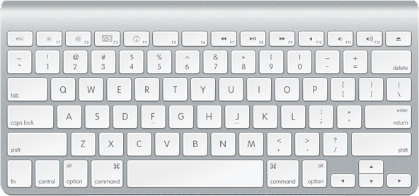
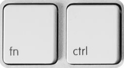

## **WinA1314**

**WinA1314** is a kernel mode driver for the **Apple Wireless Keyboard** in **Windows**.

[](http://en.wikipedia.org/wiki/Apple_Keyboard)


## Implementation Specifics

**WinA1314** is implemented as a Windows driver and service module that utilizes the **Interception** kernel mode driver (keyboard.sys) implemented by [Francisco Lopes](http://oblita.com/interception.html). This driver is already signed and allows the interception and modification of keys at kernel level. It is implemented as an upper filter above the **kbdclass.sys**, the upper level keyboard class filter driver.

Using the above solution, **WinA1314** intercepts keystrokes before they reach user-level and thus overcomes the shortcomings of the previously described user-mode applications.

## Default Key Mapppings

**WinA1314** installs the following key mappings by default, which can be altered after installation in any desirable setup.

  <table class="table-bordered" cellpadding="5">
    <tr>
      <th>Input Key(s)</th>
      <th>Output Key</th>
    </tr>
    <tr>
      <td>Ctrl</td><td>Fn <i>(configurable at installation)</i></td>
    </tr>
    <tr>
      <td>Fn</td><td>Ctrl <i>(configurable at installation)</i></td>
    </tr>
    <tr>
      <td>Left/Right Alt</td><td>Left/Right Windows <i>(configurable at installation)</i></td>
    </tr>
    <tr>
      <td>Left/Right Windows</td><td>Left/Right Alt <i>(configurable at installation)</i></td>
    </tr>
    <tr>
      <td>Eject</td><td>Delete</td>
    </tr>
    <tr>
      <td>Fn + Backspace</td><td>Delete</td>
    </tr>
    <tr>
      <td>Fn + Enter</td><td>Insert</td>
    </tr>
    <tr>
      <td>Fn + F3</td><td>(App) My Computer</td>
    </tr>
    <tr>
      <td>Fn + F4</td><td>(App) Calculator</td>
    </tr>
    <tr>
      <td>Fn + F5</td><td>Pause/Break</td>
    </tr>
    <tr>
      <td>Fn + F6</td><td>Print Screen</td>
    </tr>
    <tr>
      <td>Fn + F7</td><td>previous track</td>
    </tr>
    <tr>
      <td>Fn + F8</td><td>play/pause</td>
    </tr>
    <tr>
      <td>Fn + F9</td><td>next track</td>
    </tr>
    <tr>
      <td>Fn + F10</td><td>mute</td>
    </tr>
    <tr>
      <td>Fn + F11</td><td>volume down</td>
    </tr>
    <tr>
      <td>Fn + F12</td><td>volume up</td>
    </tr>
    <tr>
      <td>Fn + Up</td><td>Page Up</td>
    </tr>
    <tr>
      <td>Fn + Down</td><td>Page Down</td>
    </tr>
    <tr>
      <td>Fn + Left</td><td>Home</td>
    </tr>
    <tr>
      <td>Fn + Right</td><td>End</td>
    </tr>
  </table>

## Technical

You can temporarily stop the driver by issuing the following command at the command prompt:

``` net stop WinA1314 ```

To start again, type:

``` net start WinA1314 ```

You can specify your custom key mappings by adding/modifying or deleting entries in the **HKEY_LOCAL_MACHINE\SOFTWARE\WinA1314\Map** registry key. 

The values format is the following:

**```Src Key ScanCode, Src Key Extra, Reserved (0),``` ```Dst Key ScanCode, Dst Key Extra, Reserved (0),``` ```Dst Key (when Fn pressed) ScanCode, Dst Key (when Fn pressed) Extra, Reserved (0)```**

For instance, to swap keys "A" and "B" on the keyboard you will need to add the following two entries:

```30,0,0,``` ```48,0,0,``` ```0,0,0```

```48,0,0,``` ```30,0,0,``` ```0,0,0```

The key scancode can be entered in base 10 or in hex. If it is entered in hex, it should be prefixed with "0x".

To make key "A" behave as "B" when the Fn key is pressed, add the following entry:

```30,0,0,``` ```0,0,0,``` ```48,0,0```

If you want to remap the Fn key, you need to be aware that the Fn key is internally (does not make it to the OS) mapped to the scancode 0xff.

The "Extra" value is needed for some keys (such as Alt, Home, etc.). It can be used to encode the extended bit values such as E0 and E1. The extended bit value E0 is represented by number 0x2 and the extended bit E1 is represented by number 0x4.

For instance, to map the arrow down key to page down but only when the Fn key is pressed together, you will need to add the following value (numbers in hex now):

```0x50,0x2,0,``` ```0,0,0,``` ```0x51,0x2,0```

To discover key scancodes, you can use [keyview.exe](keyview.exe). Just look at the "Scan" value (which is shown in decimal but WinA1314 can also accept decimal so no need to convert). Also whenever you see the "Ext" set to Yes, you will need to set the value "2" to the "Src/Dst Key Extra" field of the WinA1314 registry. For example, if you press the arrow down key, in keyview.exe you will see: Scan=80 Ext=Yes. This means that this key in WinA1314 should be entered as "80,2,0". If you press key "A", in keyview.exe you will see: Scan=30, Ext=No. This key will be entered in WinA1314 as "30,0,0". 

If you modify any registry settings for the driver, you will need to restart it from the command line using the previously described procedure.

## Swapping the Fn and Ctrl Keycaps



After installing the driver you can optionally remove and swap the Fn and Ctrl keycaps as they have exactly the same size on this keyboard. This can be done by inserting two fingernails just underneath the two upper corners of the key and pulling it up gently.

## Known Issues

### 1. 'Ctrl + LeftShift + T' key combination (commonly used in Google Chrome to re-open closed tabs) does not work.
As a workaround use the right shift instead.

### 2. It does not work on a Mac running windows through Bootcamp.
Your option is to natively install Windows. I do not own a Mac to further check why but I have the impression that Bootcamp modifies the hardware ID of the Apple keyboard and it does not get detected by the driver.

### 3. It does not work for the wired Apple keyboard versions.
It is not designed to work with them.

### 4. The Delete key (mapped on Eject) does not currently work in typematic mode (auto-repeat). 
To overcome this, use the alternative 'Fn + Backspace' key mapping.

### 5. The Delete key (mapped on Eject) does not work immediately after reboot.
This is because the WinA1314 service, that controls the keyboard, might need a few seconds to start after you see the log-on screen on your computer.

### 6. The Fxx keys do not work or seem to have a strange behaviour.
This is may be the case if you have not uninstalled the A1314 Apple Bootcamp driver.

## Requirements

### Installation

You must have administrator rights on the OS for installation.

WinA1314 requires Windows 7 or higher. Installation on Windows Vista is also allowed, but I have not tested it.

If you have any thirt party applications such as the **UWAKS** or the **Apple Bootcamp** drivers already installed on your system, please uninstall them first before installing WinA1314.

### Building

To build the project you will need Visual Studio 2012 (or better) and the Windows Driver Kit 8. For the installer, you will need Inno Setup.


